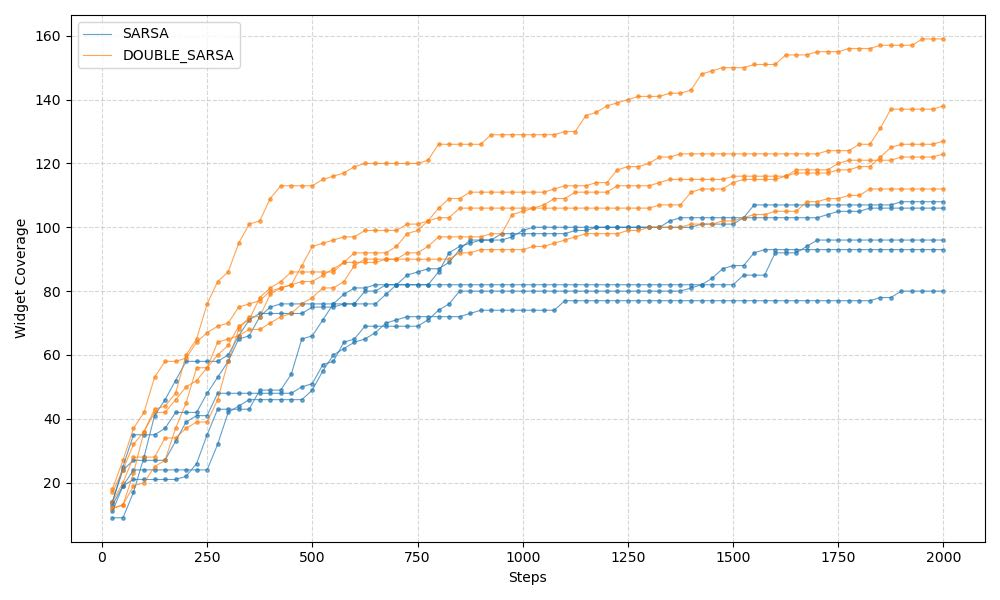
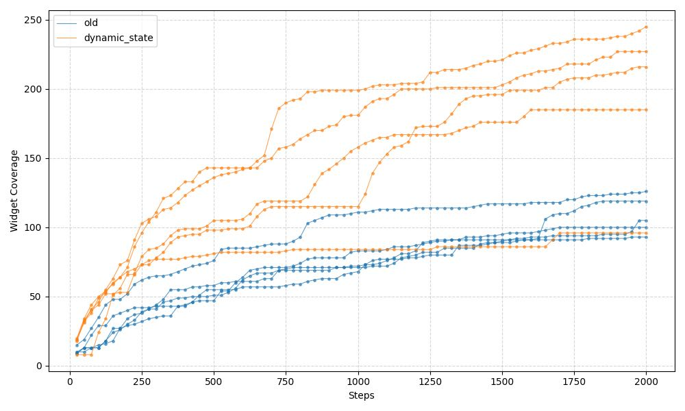

# Fastbot-Android Open Source Handbook

## Introduction

> Fastbot3 is a model-based testing tool for modeling GUI transitions to discover app stability problems. It combines machine learning and reinforcement learning techniques to assist discovery in a more intelligent way.


***More detail see at [Fastbot architecture](https://mp.weixin.qq.com/s/QhzqBFZygkIS6C69__smyQ)

We gratefully acknowledge Prof. Ting Su, the SSE Lab at East China Normal University, Dr. Tianxiao Gu（Bytedance）, and Tiesong Liu (OPay) for their valuable support and contributions.


## Features

* Compatible with the latest Android systems (Android 5–14 and beyond), including stock and manufacturer ROMs.
* **High speed**: state build ~0.1-0.5 ms, action decision ~50 ms per click; supports up to ~12 actions per second.
* Expert system supports deep customization for different business needs.
* **Reinforcement learning (RL)**: model-based testing with graph transition and high-reward action selection (e.g. Double SARSA).

### Reuse model (FBM)

* **Path (dynamic abstraction)**: On device, the default reuse model file is stored at `/sdcard/fastbot_{packagename}.fbm` (e.g. `/sdcard/fastbot_com.example.app.fbm`).
* **Path (static reuse abstraction)**: When `max.stateAbstractionMode=static_reuse` (in `/sdcard/max.config`), a separate static reuse model file is used: `/sdcard/fastbot_{packagename}.static.fbm`. This allows you to switch between dynamic and legacy static state abstraction without polluting each other's FBM.
* **Loading**: If the corresponding file exists when Fastbot starts, it is loaded by default for the given package (dynamic vs static chosen by `max.stateAbstractionMode`).
* **Saving**: During execution, the selected model file is written back periodically (e.g. every 10 minutes). You can delete or copy the file as needed.
* **Security**: The loader verifies the buffer before deserializing; invalid or corrupted files are rejected.

### Changelog

**update 2026.3**
* **Static reuse state abstraction**: Added a runtime switch in `max.config` (`max.stateAbstractionMode=dynamic|static_reuse`) to control how UI states are abstracted for RL/reuse. The default `dynamic` mode keeps the existing per-activity widget-key refinement/coarsening (mask over `Clazz|ResourceID|OperateMask|ScrollType|Text|ContentDesc|Index`). The optional `static_reuse` mode disables runtime refinement/coarsening and uses a **legacy-compatible hash**: each widget is a `RichWidget` whose hash is built from `(class + resource-id + supported actions + valid text/children text, with clickable-children masking)`, and each state hash is `hash(activityName) XOR combineHash(RichWidgets, withOrder)`. This matches the older `ReuseAgent` abstraction and uses a separate FBM file `/sdcard/fastbot_{pkg}.static.fbm` so that dynamic and static reuse models do not interfere with each other.

**update 2026.2**
* **LLM agent (LLMTaskAgent)**: Optional LLM-based custom events via `/sdcard/max.llm.tasks`: when the current screen matches a checkpoint (Activity + XPath), action selection can be handed to an LLM (e.g. for login or guided tasks). Supports optional Planner/Executor layering, first-step screenshot retry, session-scoped todo/scratchpad, and safe_mode/forbidden_texts. Configure LLM in `max.config` (e.g. `max.llm.enabled`, `max.llm.apiUrl`, `max.llm.model`). See [Configuration → LLM custom events](#llm-custom-events-maxllmtasks) and [LLM_TASK_AGENT_LLM_TECHNICAL_ANALYSIS.md](./native/agent/LLM_TASK_AGENT_LLM_TECHNICAL_ANALYSIS.md). For a survey of recent LLM/VLM-based traversal testing SOTA and technical proposals, see [LLM_VLM_TRAVERSAL_TESTING_SOTA_AND_PROPOSAL.md](./native/agent/LLM_VLM_TRAVERSAL_TESTING_SOTA_AND_PROPOSAL.md).
* **Frontier agent (FrontierAgent)**: Frontier-based exploration selectable via `--agent frontier`; MA-SLAM-style global planner (infoGain × distance, FH-DRL scoring) with local execution (direct or BFS path to target). No Q-values or reuse model. Implementation: [FrontierAgent.cpp](./native/agent/FrontierAgent.cpp). See [FRONTIER_AGENT_ALGORITHM_EXPLANATION.md](./native/agent/FRONTIER_AGENT_ALGORITHM_EXPLANATION.md).
* **ICM agent (ICMAgent)**: Curiosity-driven exploration selectable via `--agent icm`; NGU-style novelty scoring (episode × global × stateFactor × successorFactor, cap L=5) with ε-greedy action selection. No Q-values or reuse model; optional cluster novelty (16-dim handcrafted or DNN 16→16→8 embedding + online K=32 clustering). Implementation: [ICMAgent.cpp](./native/agent/ICMAgent.cpp). See [ICM_ALGORITHM_EXPLANATION.md](./native/agent/ICM_ALGORITHM_EXPLANATION.md).
* **LLM-Explorer agent (LLMExplorerAgent)**: AIG-based exploration via `--agent llmexplorer` or `--agent llm_explorer`; abstract states (activity + widget structure hash), exploration flags (unexplored/explored/ineffective), app-wide selection (current-screen unexplored first, else random over all unexplored), and fault-tolerant navigation. **LLM**: (1) **Content-aware input** — for editable widgets, `getInputTextForAction()` uses the same LLM client (`max.llm.*` in `max.config`) to suggest input text. (2) **Knowledge organization** — on first visit to an abstract state, LLM groups UI elements (JSON `groups`/`functions`); exploring one action in a group marks the whole group. Implementation: [LLMExplorerAgent.cpp](./native/agent/LLMExplorerAgent.cpp), [LLMExplorerAgent.h](./native/agent/LLMExplorerAgent.h). See [LLMExplorerAgent_ALGORITHM_EXPLANATION.md](./native/agent/LLMExplorerAgent_ALGORITHM_EXPLANATION.md).


**update 2026.1**
* **Double SARSA**: Default agent is now **DoubleSarsaAgent**, implementing N-step Double SARSA with two Q-functions (Q1, Q2) to reduce overestimation bias and improve action selection stability (see [DOUBLE_SARSA_ALGORITHM_EXPLANATION.md](./native/agent/DOUBLE_SARSA_ALGORITHM_EXPLANATION.md)). Experiment results (Widget Coverage vs Steps) show that Double SARSA consistently outperforms SARSA in coverage and convergence:

  

* **Dynamic state abstraction**: State granularity is tuned at runtime—finer when the same action leads to different screens or too many choices, coarser when states are over-split (see [STATE_ABSTRACTION_TECHNICAL_ARCHIVE.md](./native/desc/STATE_ABSTRACTION_TECHNICAL_ARCHIVE.md)). Experiment results (Widget Coverage vs Steps) show that dynamic state abstraction consistently outperforms the baseline:

  

  * **Script-driven custom events (max.xpath.actions)**: Configurable action sequences via `/sdcard/max.xpath.actions` (e.g. fixed login flow by activity). Disabled by default when LLM-driven custom events (max.llm.tasks + url/apiKey) are configured.
* **Unified avoidance rules (max.avoid.rules)**: A single config file `/sdcard/max.avoid.rules` replaces the former `max.widget.black` and `max.tree.pruning`. Use it to avoid or soften UI elements (e.g. logout, ads) via `action: "avoid"` (remove from tree + click shield) or `action: "modify"` (e.g. set `clickable: false`). See [Configuration → Unified avoidance rules](#unified-avoidance-rules-maxavoidrules).

* **Performance & security**: FBM loader verifies buffer before deserialization; activity name length is capped when serializing; KeyCompareLessThan and related reuse-model code hardened for null-safety and format.
* **XXH64**: Introduced xxHash 64-bit for fast state/action hashing in native layer.
* Support Android 14～16.

**update 2023.9**
* Add Fastbot code analysis file for quick understanding of the source code. See [fastbot_code_analysis.md](./fastbot_code_analysis.md).

**update 2023.8**
* Java & C++ code are fully open-sourced (supported by and collaborated with [Prof. Ting Su](https://mobile-app-analysis.github.io/)'s research group from East China Normal University). Welcome code or idea contributions!

**update 2023.3**
* Support Android 13.

**update 2022.1**
* Update Fastbot Revised License.

**update 2021.11**
* Support Android 12.
* New GUI fuzzing & mutation features (inspired/supported by [Themis](https://github.com/the-themis-benchmarks/home)).

**update 2021.09**
* Fastbot supports model reuse: `/sdcard/fastbot_{packagename}.fbm`. Loaded by default when present; overwritten periodically during runs.

---

## Build

### Prerequisites

* **Java**: Gradle 7.6 supports **Java 8–19** only. If you see `Unsupported class file major version 69`, your JDK is too new (e.g. Java 25). Use JDK 17 or 11: `export JAVA_HOME=$(/usr/libexec/java_home -v 17)` (macOS), or install OpenJDK 17 and point `JAVA_HOME` to it.
* **Gradle**: Required for building the Java part. Recommended to manage versions via [sdkman](https://sdkman.io/):
  ```shell
  curl -s "https://get.sdkman.io" | bash
  sdk install gradle 7.6.2
  gradle wrapper
  ```
* **NDK & CMake**: Required for building the C++ native (.so) part. You need to set **NDK_ROOT** (or **ANDROID_NDK_HOME**) to your NDK path; the build script uses `$NDK_ROOT/build/cmake/android.toolchain.cmake`. Recommended: NDK r21 or later. For step-by-step installation (Android Studio, sdkmanager, or manual), see **[NDK Install Guide](./native/NDK_INSTALL_GUIDE.md)**. If you see *CMake 'X.Y.Z' was not found in SDK*, either install that version via SDK Manager → SDK Tools → CMake (e.g. 3.22.1 or 3.18.1), or set the same version in `monkey/build.gradle` → `externalNativeBuild.cmake.version` to match the CMake version you have installed.

### Build Java (monkeyq.jar)

From the **android** project root:

**Automatic build (recommended)**  
Use the helper script to build the jar and generate the dex jar in one go. The script picks the latest build-tools and uses **d8** (or **dx** if d8 is not available):

```shell
./gradlew clean makeJar
sh build_monkeyq.sh
```

The result is `monkeyq.jar` in the project root (or as specified by the script).

**Manual build**  
If you prefer to run the dex step yourself (e.g. to pin a specific build-tools version):

```shell
./gradlew clean makeJar
# Then run one of the following (replace <version> with your build-tools version):
# d8 (recommended when dx is not in your build-tools)
$ANDROID_HOME/build-tools/<version>/d8 --min-api 22 --output=monkeyq.jar monkey/build/libs/monkey.jar
# or dx (older SDK)
$ANDROID_HOME/build-tools/<version>/dx --dex --min-sdk-version=22 --output=monkeyq.jar monkey/build/libs/monkey.jar
```

### Build native (.so)

The native C++ code is built with CMake and the Android NDK. **Prerequisites**: NDK and CMake installed, and **NDK_ROOT** set (see [NDK Install Guide](./native/NDK_INSTALL_GUIDE.md)).

From the **android** project root:

```shell
cd native
sh ./build_native.sh
```

Or in one line: `cd native && sh ./build_native.sh`.

The script builds for **armeabi-v7a**, **arm64-v8a**, **x86**, and **x86_64**. After a successful build, the `.so` files are under **android/libs/** (e.g. `libs/arm64-v8a/libfastbot_native.so`). Push this directory to the device when deploying (see [Usage](#usage)).

---

## Usage

### One-click run (activate_fastbot.sh)

For a quick run with default settings, use the **activate_fastbot.sh** script from the **android** directory. It will:

- Push built artifacts (monkeyq.jar, dependency jars, native libs, framework.jar) to the device  
- Push config files from `test/` if present (`max.config`, `max.llm.tasks`)  
- Optionally install and enable ADBKeyBoard for Chinese/emoji input (if `test/ADBKeyBoard.apk` or `test/keyboardservice-debug.apk` exists)  
- Run the monkey with env-based LLM config (`MAX_LLM_API_URL`, `MAX_LLM_API_KEY`) and pull logs to `android/logs/`

**Prerequisites:** Build artifacts first (see [Build](#build)). Ensure one device is connected (`adb devices`).

**Customize:** Edit the script to set the target package (`-p`), duration (`--running-minutes`), throttle (`--throttle`), and env vars (e.g. `LLM_LOGIN_ACCOUNT`, `LLM_LOGIN_PASSWORD`, `MAX_LLM_API_URL`, `MAX_LLM_API_KEY`) as needed.

```shell
# From android project root, after building
sh activate_fastbot.sh
```

### Environment preparation

1. Build artifacts (see [Build](#build)):
   ```shell
   ./gradlew clean makeJar
   $ANDROID_HOME/build-tools/28.0.3/dx --dex --min-sdk-version=22 --output=monkeyq.jar monkey/build/libs/monkey.jar
   cd native && sh build_native.sh
   ```

2. Push artifacts to the device:
   ```shell
   adb push monkeyq.jar /sdcard/monkeyq.jar
   adb push fastbot-thirdpart.jar /sdcard/fastbot-thirdpart.jar
   adb push libs/* /data/local/tmp/
   adb push framework.jar /sdcard/framework.jar
   ```

### Run Fastbot (shell)

```shell
adb -s <device_serial> shell CLASSPATH=/sdcard/monkeyq.jar:/sdcard/framework.jar:/sdcard/fastbot-thirdpart.jar exec app_process /system/bin com.android.commands.monkey.Monkey -p <package_name> --agent reuseq --running-minutes <duration_min> --throttle <delay_ms> -v -v
```

* Before running, you can push valid strings from the APK to `/sdcard` to improve the model (use `aapt2` or `aapt` from your Android SDK, e.g. `${ANDROID_HOME}/build-tools/28.0.2/aapt2`):
  ```shell
  aapt2 dump --values strings <testApp_path.apk> > max.valid.strings
  adb push max.valid.strings /sdcard
  ```

#### Required parameters

| Parameter | Description |
|-----------|-------------|
| `-s <device_serial>` | Device ID (required if multiple devices are connected; check with `adb devices`) |
| `-p <package_name>` | App package under test (e.g. from `adb shell pm list packages`) |
| `--agent <type>` | Strategy: **`sarsa`** — legacy SarsaAgent (single-Q SARSA + reuse model); **`reuseq`** or **`double-sarsa`** — Double SARSA (default, recommended); |
| `--running-minutes <duration>` | Total test duration in minutes |
| `--throttle <delay_ms>` | Delay between actions in milliseconds |

#### Optional parameters

| Parameter | Description |
|-----------|-------------|
| `--bugreport` | Include bug report when a crash occurs |
| `--output-directory <path>` | Output directory (e.g. `/sdcard/xxx`) |

#### Optional fuzzing data

```shell
adb push data/fuzzing/ /sdcard/
adb shell am broadcast -a android.intent.action.MEDIA_SCANNER_SCAN_FILE -d file:///sdcard/fuzzing
```  

> For more details, see the [Chinese handbook](./handbook-cn.md).

#### Optional: ADBKeyBoard (Chinese/emoji input)

If you use **activate_fastbot.sh** and want IME text input (e.g. Chinese), the script pushes and installs **ADBKeyBoard** from `test/ADBKeyBoard.apk`. The APK **must target SDK 24+**; otherwise you will see `INSTALL_FAILED_DEPRECATED_SDK_VERSION`. Replace `android/test/ADBKeyBoard.apk` with a compatible build, e.g. from [senzhk/ADBKeyBoard releases](https://github.com/senzhk/ADBKeyBoard/releases) (e.g. **v2.4-dev** → `keyboardservice-debug.apk`), and save it as `android/test/ADBKeyBoard.apk`.

**If log shows "Input (...) is successfully sent: true" but nothing appears in the input field:**

1. **IME package must match** – The monkey uses `com.android.adbkeyboard/.AdbIME` by default. If you installed `keyboardservice-debug.apk` from senzhk/ADBKeyBoard, it uses the same package; other forks may use a different package. Run `adb shell ime list -s` and ensure your IME is enabled and set: `adb shell ime set <your.ime/.Component>`.
2. **Current IME** – After tapping the input field, the app may switch back to the system keyboard. The monkey switches to ADBKeyBoard before sending; check the log line `Current IME: ...` to confirm it is your ADBKeyBoard component. If it is not, the focused field is bound to another IME and will not receive the text.
3. **Focus** – The touch that focuses the input must happen before the IME event; the 600 ms delay after switching IME gives the system time to bind the connection. If the field loses focus (e.g. dialog closes), the text will not show.


### Configuration

#### LLM custom events (max.llm.tasks)

Fastbot supports **LLM-based custom events**: when the current screen matches a configured checkpoint (Activity + XPath), the engine can hand over action selection to an LLM agent (e.g. for login flows or guided tasks) until the task completes or times out.

**Where to configure**

| Purpose | Path (on device) | Format |
|---------|------------------|--------|
| LLM switch, API URL, model, etc. | **`/sdcard/max.config`** | `key=value`, one per line |
| Task list (checkpoints + descriptions) | **`/sdcard/max.llm.tasks`** | JSON array |

* **LLM runtime**: Configure in **`/sdcard/max.config`**. Native reads it in `Preference::loadBaseConfig()`; if the file is missing or `max.llm.enabled=true` is not set, LLMTaskAgent will not call the LLM.
* **Task definitions**: Configure in **`/sdcard/max.llm.tasks`**. See the JSON example below; push with: `adb push test/max.llm.tasks /sdcard/max.llm.tasks`.

**LLM-related keys in max.config (example)**

To avoid leaking secrets, **do not put the real API URL or API key in committed files**. Use placeholders in `max.config` and set the real values **on the device** when launching the monkey—the native layer resolves `max.llm.apiUrl` and `max.llm.apiKey` from the process environment when the value is `${VAR_NAME}` or when the value is empty (fallback: `MAX_LLM_API_URL`, `MAX_LLM_API_KEY`).

```properties
max.llm.enabled=true
max.llm.apiUrl=${MAX_LLM_API_URL}
max.llm.apiKey=${MAX_LLM_API_KEY}
max.llm.model=gpt-4o-mini
max.llm.maxTokens=512
max.llm.timeoutMs=20000
```

**State abstraction & reuse mode keys in max.config (example)**

```properties
# Dynamic state abstraction (default): mask refined/coarsened at runtime, reuse model at /sdcard/fastbot_{pkg}.fbm
max.stateAbstractionMode=dynamic

# Legacy static reuse abstraction (optional): fully-aligned with old ReuseAgent state hashing,
# reuse model stored in /sdcard/fastbot_{pkg}.static.fbm
# max.stateAbstractionMode=static_reuse
```

**Setting environment variables on the device**

Push a `max.config` with placeholders (`max.llm.apiUrl=${MAX_LLM_API_URL}` and `max.llm.apiKey=${MAX_LLM_API_KEY}`), then set the real URL and key in the **same shell** that starts the monkey. **Important:** Each `adb shell` starts a new session, so `adb shell` → `export VAR=...` → `exit` → next `adb shell` will **not** see those variables. Use one of the following:

- **One-liner:** Set env vars and run the monkey in a single `adb shell` command:
  ```bash
  adb shell "export MAX_LLM_API_URL='https://...'; export MAX_LLM_API_KEY='sk-...'; CLASSPATH=/sdcard/monkeyq.jar:/sdcard/framework.jar:/sdcard/fastbot-thirdpart.jar exec app_process /system/bin com.android.commands.monkey.Monkey -p <package> --agent reuseq --running-minutes 60 --throttle 300 -v -v"
  ```
- **Wrapper script (recommended):** Put exports and the monkey command in a script, push it to the device, then run that script so env and process share one shell session.
  1. Create `run_fastbot.sh` on your PC:
     ```bash
     #!/system/bin/sh
     export CLASSPATH=/sdcard/monkeyq.jar:/sdcard/framework.jar:/sdcard/fastbot-thirdpart.jar
     export MAX_LLM_API_URL='https://your-llm-server.com/v1/chat/completions'
     export MAX_LLM_API_KEY='your-api-key-here'
     export LLM_LOGIN_ACCOUNT='user@example.com'   # optional, for task placeholder
     export LLM_LOGIN_PASSWORD='secret'            # optional
     exec app_process /system/bin com.android.commands.monkey.Monkey -p <package> --agent reuseq --running-minutes 60 --throttle 300 -v -v
     ```
     Replace URL, key, `<package>`, and optional account/password.
  2. Push and run on the device:
     ```bash
     adb push run_fastbot.sh /data/local/tmp/
     adb shell chmod +x /data/local/tmp/run_fastbot.sh
     adb shell /data/local/tmp/run_fastbot.sh
     ```
     The script runs in one shell session, so the exports are visible to `app_process` and env vars persist for the whole run.

Config template with placeholders: **`test/max.config`**; the native layer will read URL/key from the process environment at runtime.

* **Path**: Push the task config file to `/sdcard/max.llm.tasks`.
* **Format**: JSON array of task objects. Example:

  ```json
  [
    {
      "activity": "xxx",
      "checkpoint_xpath": "//*[contains(@text,'Login') or contains(@content-desc,'Login')]",
      "task_description": "On the login page: enter account ${LLM_LOGIN_ACCOUNT} and password ${LLM_LOGIN_PASSWORD}, then tap the login button.",
      "max_steps": 10,
      "max_duration_ms": 30000,
      "safe_mode": false,
      "forbidden_texts": ["Log out", "Delete account", "Sign out"],
      "use_planner": true,
      "use_llm_step_summary": true,
      "max_times": 1,
      "reset_count": false
    }
  ]
  ```

* **Environment variable substitution (action input only)**: To avoid sending account/password to the LLM, describe the task with placeholders in `task_description` (e.g. “enter account \${LLM_LOGIN_ACCOUNT} and password \${LLM_LOGIN_PASSWORD}”). The LLM will then return an INPUT action whose text is that placeholder (e.g. `"${LLM_LOGIN_ACCOUNT}"`). **Substitution happens only when executing the action**: when the native layer builds the final Operate for the device, it replaces `${VAR_NAME}` in the action’s input text with `getenv("VAR_NAME")`. So secrets are never sent to the LLM; they are read from the process environment only at execution time. Set env vars in the device shell before starting the monkey, e.g.:
  ```bash
  adb shell "export LLM_LOGIN_ACCOUNT='user@example.com'; export LLM_LOGIN_PASSWORD='secret'; CLASSPATH=... exec app_process ..."
  ```
  Example names: `LLM_LOGIN_ACCOUNT`, `LLM_LOGIN_PASSWORD`. Any `${OTHER_VAR}` in the **action input text** is substituted at execution.

* **Main fields**:
  * `activity`: Target activity (empty = any activity); match is then by `checkpoint_xpath` on the UI tree.
  * `checkpoint_xpath`: XPath that must match on the current page to start this task.
  * `task_description`: Natural language instruction for the LLM. Use placeholders like `${LLM_LOGIN_ACCOUNT}` here; the LLM may echo them in INPUT actions, and they are replaced from env only when the action is executed.
  * `max_steps`: Maximum number of LLM steps allowed for this task (default 10). Session aborts when reached.
  * `max_duration_ms`: Maximum duration in milliseconds for the LLM session (default 30000). Session aborts when exceeded.
  * `use_planner`: If true, a Planner layer outputs semantic steps (e.g. tap/scroll/type_text) and an Executor performs them; if false, a single LLM call decides the next action each step (default true).
  * `use_llm_step_summary`: If true, call the LLM for a one-line step summary after each action; if false, use a local summary (default false). Affects prompt size and latency.
  * `max_times`: Maximum times this task can be matched and run in the whole test session (default 0 = unlimited). When set to e.g. 1, the task is triggered at most once.
  * `reset_count`: If true, when the current activity switches to a different activity, this task’s run count is cleared—so re-entering the activity can match the task again until `max_times` is reached. If false, run count is never reset; `max_times` is a hard limit for the session (default false).
  * `safe_mode`: If true, elements whose text/content-desc contain any `forbidden_texts` string are not clicked (session aborts).
  * `forbidden_texts`: List of strings; when `safe_mode` is true, elements containing any of these are not clicked.

* **LLM runtime**: Enable and configure the LLM in `max.config` (e.g. `max.llm.enabled=true`, `max.llm.apiUrl`, `max.llm.apiKey`, `max.llm.model`, etc.). The agent uses an OpenAI-compatible HTTP API.

* **Example**: See `test/max.llm.tasks` in the repo for a sample. Push to device:  
  `adb push test/max.llm.tasks /sdcard/max.llm.tasks`

**LLM agent flow (summary)**: `Model::getOperateOpt` builds state, then calls `LLMTaskAgent::selectNextAction(activity, element, screenshot)`. If the current page matches a task’s activity + checkpoint_xpath, that task session runs and the LLM (optionally Planner→Executor) produces the next action as `ActionPtr`; otherwise normal RL is used. Config: `Preference::loadBaseConfig()` reads `max.config` for `LlmRuntimeConfig`, and `Preference::loadLlmTasks()` reads `max.llm.tasks` for the task list. See [LLM_TASK_AGENT_LLM_TECHNICAL_ANALYSIS.md](./native/agent/LLM_TASK_AGENT_LLM_TECHNICAL_ANALYSIS.md).

#### Unified avoidance rules (max.avoid.rules)

**Replaces** the former **max.widget.black** and **max.tree.pruning** with a single config file. Use it to hide or soften UI elements so the agent avoids clicking them (e.g. logout, ads).

* **Path**: `/sdcard/max.avoid.rules`
* **Format**: JSON array of rule objects. Push: `adb push test/max.avoid.rules /sdcard/max.avoid.rules`

**Rule fields**

| Field | Required | Description |
|-------|----------|-------------|
| `activity` | Yes | Activity name this rule applies to; use `""` for all activities |
| `action` | Yes | **`"avoid"`** — remove matched nodes from the tree and add their bounds to the click shield (model and fuzz will not click there); **`"modify"`** — only override properties (e.g. `clickable: false`), node stays in tree |
| `xpath` | Conditional | XPath to match nodes; for `avoid` can be used alone or with `bounds`; for `modify` required |
| `bounds` | No | Optional rect: `[x1,y1][x2,y2]` or `x1,y1,x2,y2`; values in [0, 1.1] are treated as relative to screen size |
| `resourceid`, `text`, `contentdesc`, `classname`, `clickable` | No | Only for `action: "modify"`; e.g. `"clickable": "false"` to make element non-clickable in the model |

**Example**

```json
[
  {"activity": "com.example.MainActivity", "xpath": "//*[@resource-id='com.example:id/logout']", "action": "avoid"},
  {"activity": "", "xpath": "//*[contains(@text,'ad')]", "action": "avoid"},
  {"activity": "com.example.SettingsActivity", "xpath": "//*[@resource-id='id/danger_btn']", "action": "modify", "clickable": "false"}
]
```

* **Deprecated**: `max.widget.black` and `max.tree.pruning` are no longer loaded. Migration and design details: [UNIFIED_AVOIDANCE_RULES_DESIGN.md](./native/events/UNIFIED_AVOIDANCE_RULES_DESIGN.md).

#### Custom event sequence (max.xpath.actions)

You can define **scripted action sequences** per activity (e.g. login flow) so that when the current activity matches, Fastbot runs your steps instead of the RL agent for that period.

* **Path**: `/sdcard/max.xpath.actions`
* **Format**: JSON array of **cases**. Each case: `activity`, `prob` (0–1 or 1 = 100%), `times`, `throttle` (ms), and `actions`: array of `{ "xpath"?, "action", "text"? }`.
* **Action types**: `CLICK`, `LONG_CLICK`, `BACK`, `SCROLL_TOP_DOWN`, `SCROLL_BOTTOM_UP`, `SCROLL_LEFT_RIGHT`, `SCROLL_RIGHT_LEFT`. For `CLICK` with input, add `"text": "content to type"`.
* **Behavior**: When not already running a case, a case matching the current activity is chosen with probability `prob`. Steps run in order; each step finds the element by `xpath` (except `BACK`) and builds a custom action. When the sequence finishes, control returns to the normal agent.
* **Example**: See `test/max.xpath.actions`. Push: `adb push test/max.xpath.actions /sdcard/max.xpath.actions`

* **Priority**: If **max.llm.tasks** is loaded and **LLM url and apiKey** are set in max.config, **max.xpath.actions** custom events are disabled for that run (LLM/RL only).

Use **max.llm.tasks** when you need LLM-driven, checkpoint-triggered behavior (e.g. “on login screen, ask LLM to complete login”). Use **max.xpath.actions** for fixed, xpath-based sequences without LLM.

### Results

#### Crashes and ANR

* Java crashes, ANR, and native crashes are logged to `/sdcard/crash-dump.log`.
* ANR traces are written to `/sdcard/oom-traces.log`.

#### Activity coverage

* After the run, the shell prints the total activity list, explored activities, and coverage rate.
* **Coverage** = exploredActivity / totalActivity × 100%.
* **Note**: `totalActivity` comes from `PackageManager.getPackageInfo` and may include unused, invisible, or unreachable activities.

---

## Code structure and extension

### Layout

* **Java**: `monkey/` — device interaction, local server, and passing GUI info to native.
* **Native (C++)**: `native/` — reward computation and action selection; returns the next action to the client as an Operate object (e.g. JSON).

For a guided tour of the codebase, see [fastbot_code_analysis.md](./fastbot_code_analysis.md).

### Extending Fastbot

You can extend both the Java and C++ layers. Refer to the code analysis document and the handbook for details.

---

## Acknowledgement

* We thank Prof. Ting Su (East China Normal University), Dr. Tianxiao Gu, Prof. Zhendong Su (ETH Zurich), and others for insights and code contributions.
* We thank Prof. Yao Guo (PKU) for useful discussions on Fastbot.
* We thank Prof. Zhenhua Li (THU) and Dr. Liangyi Gong (THU) for their helpful opinions on Fastbot.
* We thank Prof. Jian Zhang (Chinese Academy of Sciences) for valuable advice.

---

## Publications

If you use this work in your research, please cite:

1. Lv, Zhengwei, Chao Peng, Zhao Zhang, Ting Su, Kai Liu, Ping Yang (2022). “Fastbot2: Reusable Automated Model-based GUI Testing for Android Enhanced by Reinforcement Learning”. In Proceedings of the 37th IEEE/ACM International Conference on Automated Software Engineering (ASE 2022). [[pdf]](https://se-research.bytedance.com/pdf/ASE22.pdf)

```bibtex
@inproceedings{fastbot2,
  title={Fastbot2: Reusable Automated Model-based GUI Testing for Android Enhanced by Reinforcement Learning},
  author={Lv, Zhengwei and Peng, Chao and Zhang, Zhao and Su, Ting and Liu, Kai and Yang, Ping},
  booktitle={Proceedings of the 37th IEEE/ACM International Conference on Automated Software Engineering (ASE 2022)},
  year={2022}
}
```

2. Peng, Chao, Zhao Zhang, Zhengwei Lv, Ping Yang (2022). “MUBot: Learning to Test Large-Scale Commercial Android Apps like a Human”. In Proceedings of the 38th International Conference on Software Maintenance and Evolution (ICSME 2022). [[pdf]](https://se-research.bytedance.com/pdf/ICSME22B.pdf)

```bibtex
@inproceedings{mubot,
  title={MUBot: Learning to Test Large-Scale Commercial Android Apps like a Human},
  author={Peng, Chao and Zhang, Zhao and Lv, Zhengwei and Yang, Ping},
  booktitle={Proceedings of the 38th International Conference on Software Maintenance and Evolution (ICSME 2022)},
  year={2022}
}
```

3. Cai, Tianqin, Zhao Zhang, and Ping Yang. “Fastbot: A Multi-Agent Model-Based Test Generation System”. In Proceedings of the IEEE/ACM 1st International Conference on Automation of Software Test. 2020. [[pdf]](https://se-research.bytedance.com/pdf/AST20.pdf)

```bibtex
@inproceedings{fastbot,
  title={Fastbot: A Multi-Agent Model-Based Test Generation System},
  author={Cai, Tianqin and Zhang, Zhao and Yang, Ping},
  booktitle={Proceedings of the IEEE/ACM 1st International Conference on Automation of Software Test},
  pages={93--96},
  year={2020}
}
```

---

## Contributors

Zhao Zhang, Jianqiang Guo, Yuhui Su, Tianxiao Gu, Zhengwei Lv, Tianqin Cai, Chao Peng, Bao Cao, Shanshan Shao, Dingchun Wang, Jiarong Fu, Ping Yang, Ting Su, Mengqian Xu

We welcome more contributors.
